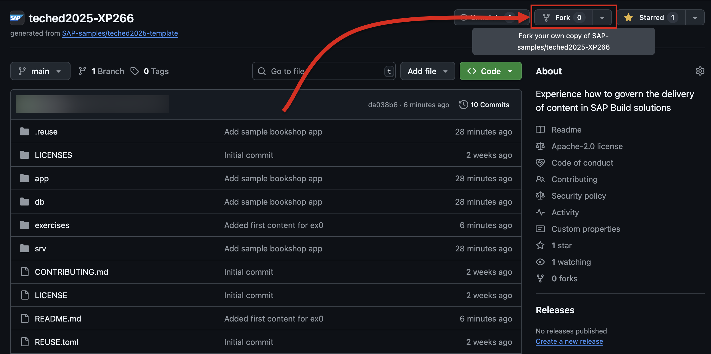
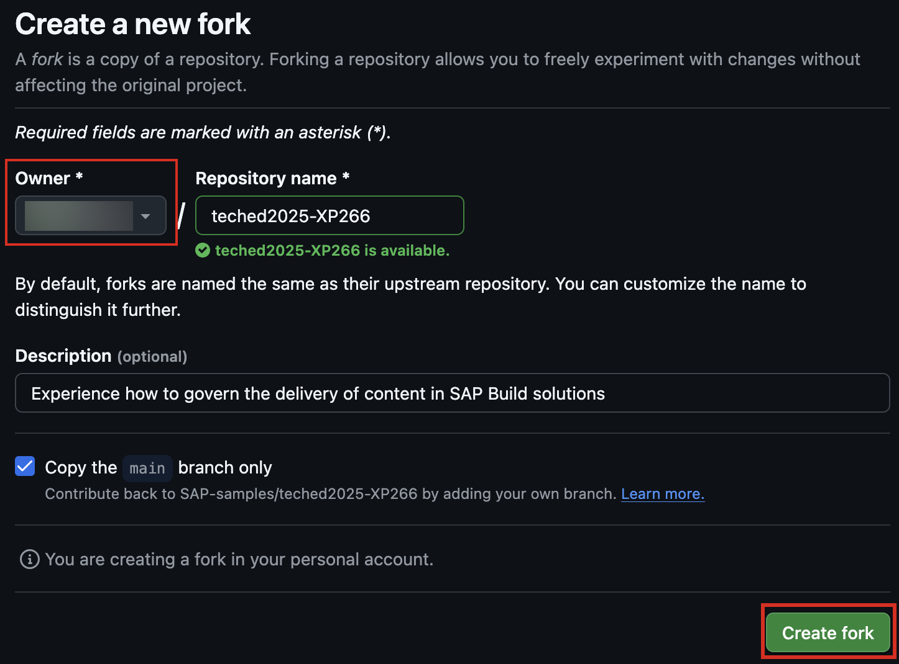

# Exercise 0 - Preparation Steps

In this exercise, you will create your own copy of this repository and optionally, set up a GitHub account.

Finally you will login to for this session prepared BTP account.

## Exercise 0.0 - (Optional) Create a GitHub account

1. Navigate to [GitHub](https://github.com/).

2. Click **Sign up for GiHhub**.

3. Alternatevly, click on **Continue with Google** to sign up using social login.

4. Follow the prompts to create your personal account.

## Exercise 0.1 - Create a Copy of This Repository

1. Login to [GitHub](https://github.com/).

2. On the [main page of this repository](https://github.com/SAP-samples/teched2025-XP266), choose **Fork** on the top right.

    

3. Make sure that the **Owner** matches the GitHub account that you want to use for this session. All the other information can remain the same.

    
