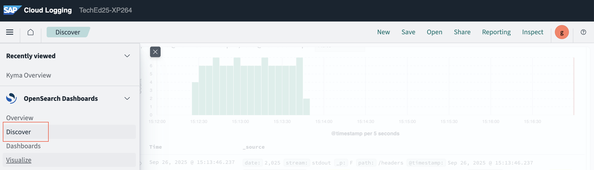
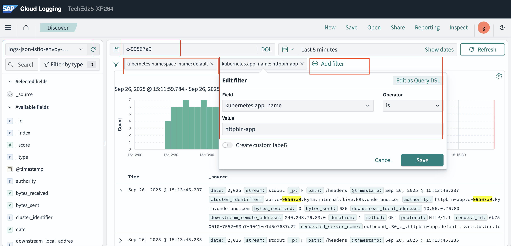
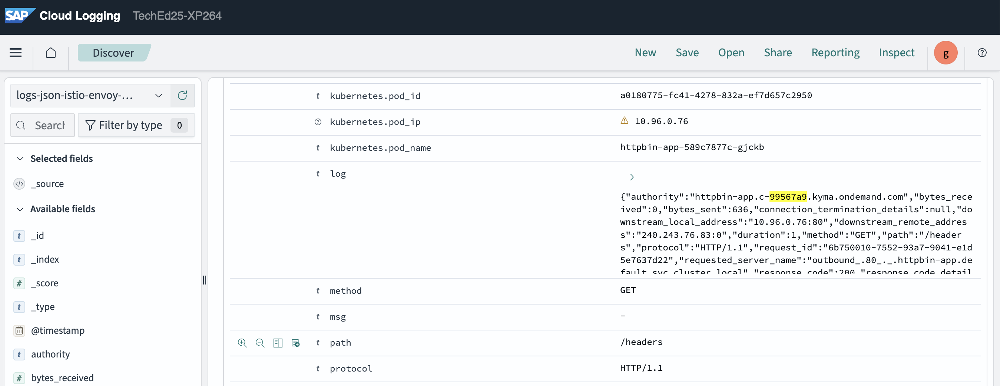
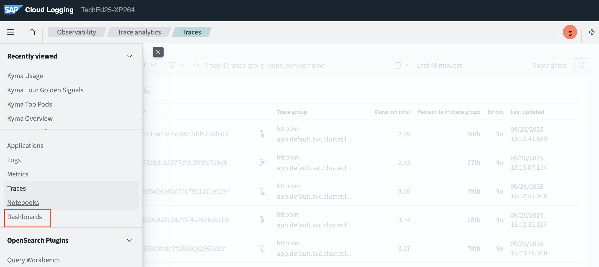
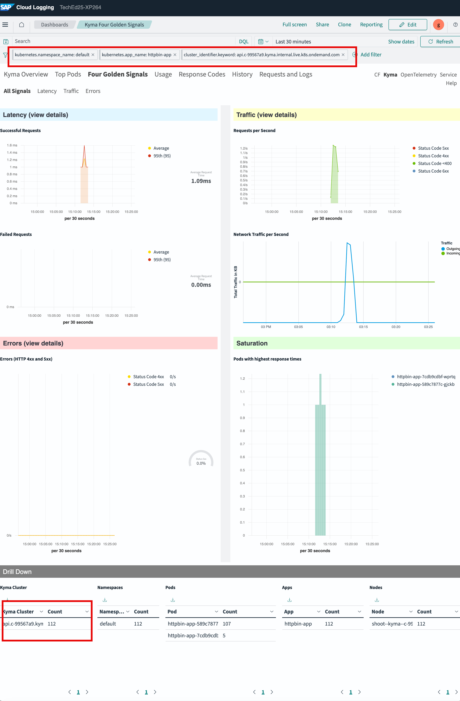
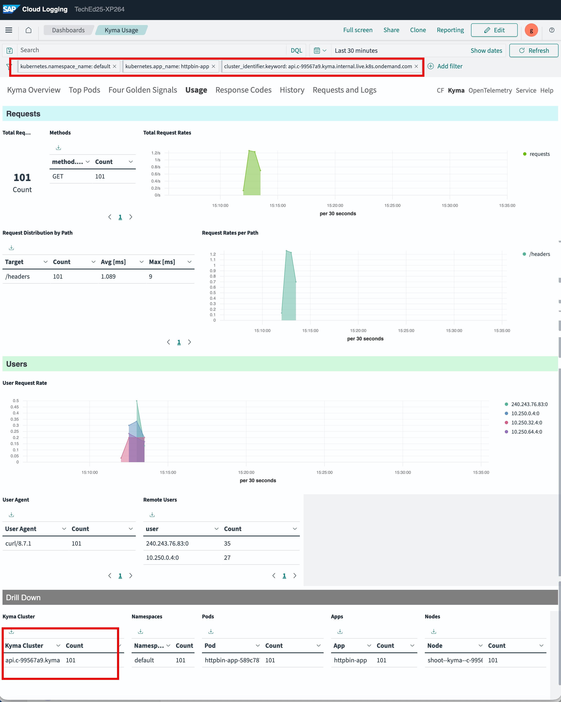
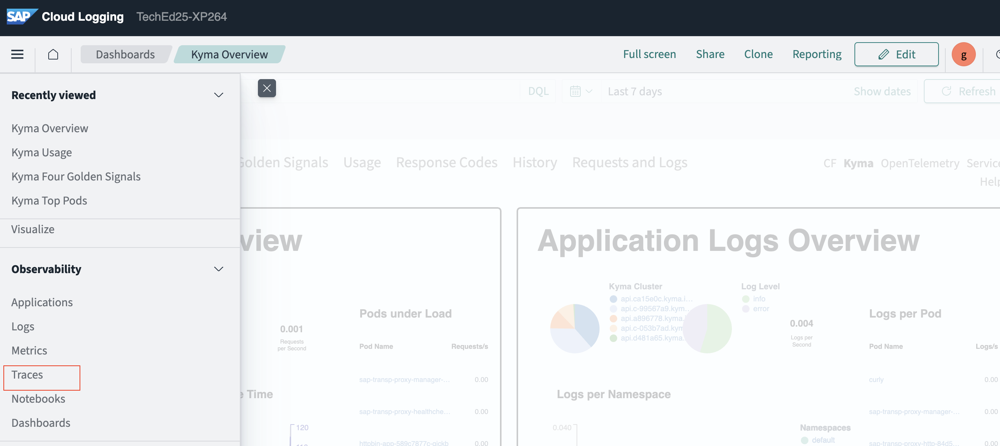
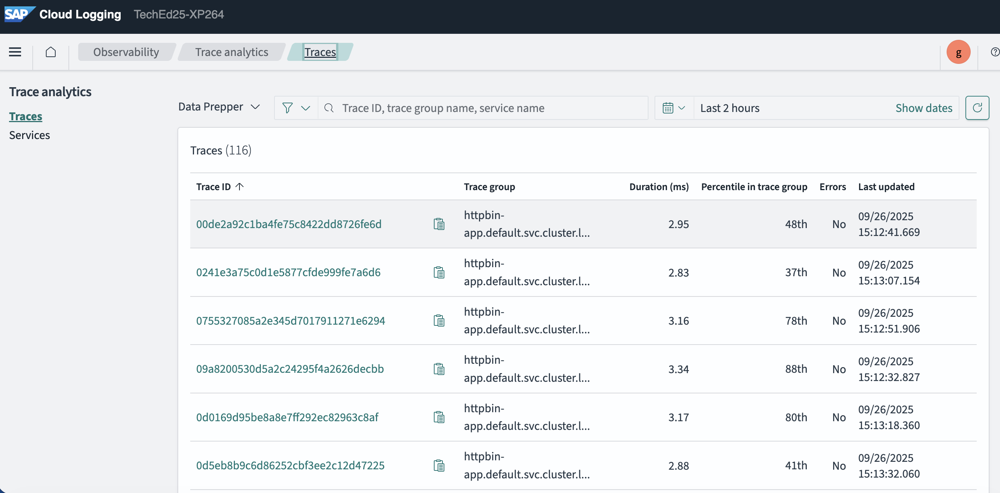
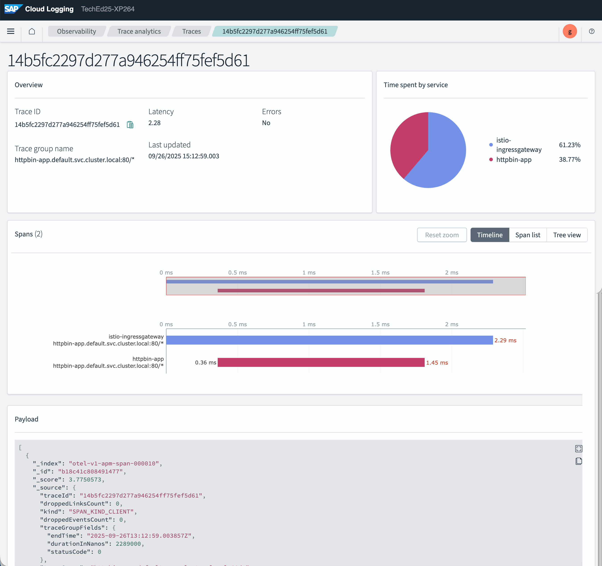

# Exercise 3: Exploring Kyma Telemetry with SAP Cloud Logging

## Simulate some load

Lets make some HTTP requests to the Httpbin application previously deployed in the Kyma runtime.

- Run the GitHub action ending with `telemetry`.
- It will make 10 requests to the Httpbin application.
- You can change the request count if you would like to simulate more load.

Once completed, we would navigate to SAP Cloud Logging to explore the three pillars of Kyma Telemetry: Logs, Metrics and Traces.

## Access SAP Cloud Logging

- Access the SAP Cloud Logging from the Link provided

- Navigate to `Discover` to acess the logs

### Explore Logs

- Lets explore the logs generated by the Httpbin application.
- Refine the search be introducing the following settings:
  - Index pattern: `log-json-istio-envoy-kyma-*`
  - In search bar, enter your cluster id to get only logs from your cluster e.g. `c-99567a`
  - Add filters for namespace and app name as shown below
  
- Open any one of the log entries to see the details.
  
- Feel free to explore further

### Explore Metrics

There are some pre-defined dashboards available in SAP Cloud Logging. Lets explore some of them.

- Select `Dashboards` from the left menu
  

- Check the overview dashboard. Apply the filters as shown below to narrow down details to your cluster and application
  

- Similarly check `Four golden signals` and `usage` dashboards
  
  

- Feel free to explore further

### Explore Traces

- Select `Traces` from the left menu
  
- Select one of the traces to see the details
  
- The Trace view shows the request flow from istio ingress gateway to the Httpbin application
  
  >Note: Some Trace spans may be jumbled up
- Feel free to explore further
