## jupyter hub

```
$ pip install matplotlib
Defaulting to user installation because normal site-packages is not writeable
Collecting matplotlib
  Downloading matplotlib-3.10.7-cp312-cp312-manylinux2014_x86_64.manylinux_2_17_x86_64.whl.metadata (11 kB)
Collecting contourpy>=1.0.1 (from matplotlib)
  Downloading contourpy-1.3.3-cp312-cp312-manylinux_2_27_x86_64.manylinux_2_28_x86_64.whl.metadata (5.5 kB)
Collecting cycler>=0.10 (from matplotlib)
  Downloading cycler-0.12.1-py3-none-any.whl.metadata (3.8 kB)
Collecting fonttools>=4.22.0 (from matplotlib)
  Downloading fonttools-4.60.1-cp312-cp312-manylinux1_x86_64.manylinux2014_x86_64.manylinux_2_17_x86_64.manylinux_2_5_x86_64.whl.metadata (112 kB)
Collecting kiwisolver>=1.3.1 (from matplotlib)
  Downloading kiwisolver-1.4.9-cp312-cp312-manylinux2014_x86_64.manylinux_2_17_x86_64.whl.metadata (6.3 kB)
Collecting numpy>=1.23 (from matplotlib)
  Downloading numpy-2.3.4-cp312-cp312-manylinux_2_27_x86_64.manylinux_2_28_x86_64.whl.metadata (62 kB)
Requirement already satisfied: packaging>=20.0 in /usr/local/lib/python3.12/site-packages (from matplotlib) (25.0)
Collecting pillow>=8 (from matplotlib)
  Downloading pillow-12.0.0-cp312-cp312-manylinux_2_27_x86_64.manylinux_2_28_x86_64.whl.metadata (8.8 kB)
Collecting pyparsing>=3 (from matplotlib)
  Downloading pyparsing-3.2.5-py3-none-any.whl.metadata (5.0 kB)
Requirement already satisfied: python-dateutil>=2.7 in /usr/local/lib/python3.12/site-packages (from matplotlib) (2.9.0.post0)
Requirement already satisfied: six>=1.5 in /usr/local/lib/python3.12/site-packages (from python-dateutil>=2.7->matplotlib) (1.17.0)
Downloading matplotlib-3.10.7-cp312-cp312-manylinux2014_x86_64.manylinux_2_17_x86_64.whl (8.7 MB)
   ━━━━━━━━━━━━━━━━━━━━━━━━━━━━━━━━━━━━━━━━ 8.7/8.7 MB 27.8 MB/s eta 0:00:00
Downloading contourpy-1.3.3-cp312-cp312-manylinux_2_27_x86_64.manylinux_2_28_x86_64.whl (362 kB)
Downloading cycler-0.12.1-py3-none-any.whl (8.3 kB)
Downloading fonttools-4.60.1-cp312-cp312-manylinux1_x86_64.manylinux2014_x86_64.manylinux_2_17_x86_64.manylinux_2_5_x86_64.whl (4.9 MB)
   ━━━━━━━━━━━━━━━━━━━━━━━━━━━━━━━━━━━━━━━━ 4.9/4.9 MB 25.7 MB/s eta 0:00:00
Downloading kiwisolver-1.4.9-cp312-cp312-manylinux2014_x86_64.manylinux_2_17_x86_64.whl (1.5 MB)
   ━━━━━━━━━━━━━━━━━━━━━━━━━━━━━━━━━━━━━━━━ 1.5/1.5 MB 15.0 MB/s eta 0:00:00
Downloading numpy-2.3.4-cp312-cp312-manylinux_2_27_x86_64.manylinux_2_28_x86_64.whl (16.6 MB)
   ━━━━━━━━━━━━━━━━━━━━━━━━━━━━━━━━━━━━━━━━ 16.6/16.6 MB 23.8 MB/s eta 0:00:00
Downloading pillow-12.0.0-cp312-cp312-manylinux_2_27_x86_64.manylinux_2_28_x86_64.whl (7.0 MB)
   ━━━━━━━━━━━━━━━━━━━━━━━━━━━━━━━━━━━━━━━━ 7.0/7.0 MB 23.4 MB/s eta 0:00:00
Downloading pyparsing-3.2.5-py3-none-any.whl (113 kB)
Installing collected packages: pyparsing, pillow, numpy, kiwisolver, fonttools, cycler, contourpy, matplotlib
  WARNING: The scripts f2py and numpy-config are installed in '/home/jovyan/.local/bin' which is not on PATH.
  Consider adding this directory to PATH or, if you prefer to suppress this warning, use --no-warn-script-location.
  WARNING: The scripts fonttools, pyftmerge, pyftsubset and ttx are installed in '/home/jovyan/.local/bin' which is not on PATH.
  Consider adding this directory to PATH or, if you prefer to suppress this warning, use --no-warn-script-location.
Successfully installed contourpy-1.3.3 cycler-0.12.1 fonttools-4.60.1 kiwisolver-1.4.9 matplotlib-3.10.7 numpy-2.3.4 pillow-12.0.0 pyparsing-3.2.5

[notice] A new release of pip is available: 25.0.1 -> 25.2
[notice] To update, run: pip install --upgrade pip


$ pip install scipy
Defaulting to user installation because normal site-packages is not writeable
Collecting scipy
  Downloading scipy-1.16.2-cp312-cp312-manylinux2014_x86_64.manylinux_2_17_x86_64.whl.metadata (62 kB)
Requirement already satisfied: numpy<2.6,>=1.25.2 in ./.local/lib/python3.12/site-packages (from scipy) (2.3.4)
Downloading scipy-1.16.2-cp312-cp312-manylinux2014_x86_64.manylinux_2_17_x86_64.whl (35.7 MB)
   ━━━━━━━━━━━━━━━━━━━━━━━━━━━━━━━━━━━━━━━━ 35.7/35.7 MB 23.8 MB/s eta 0:00:00
Installing collected packages: scipy
Successfully installed scipy-1.16.2

[notice] A new release of pip is available: 25.0.1 -> 25.2
[notice] To update, run: pip install --upgrade pip
$ 


$ pip install ipywidgets
Defaulting to user installation because normal site-packages is not writeable
Collecting ipywidgets
  Downloading ipywidgets-8.1.7-py3-none-any.whl.metadata (2.4 kB)
Requirement already satisfied: comm>=0.1.3 in /usr/local/lib/python3.12/site-packages (from ipywidgets) (0.2.3)
Requirement already satisfied: ipython>=6.1.0 in /usr/local/lib/python3.12/site-packages (from ipywidgets) (9.6.0)
Requirement already satisfied: traitlets>=4.3.1 in /usr/local/lib/python3.12/site-packages (from ipywidgets) (5.14.3)
Collecting widgetsnbextension~=4.0.14 (from ipywidgets)
  Downloading widgetsnbextension-4.0.14-py3-none-any.whl.metadata (1.6 kB)
Collecting jupyterlab_widgets~=3.0.15 (from ipywidgets)
  Downloading jupyterlab_widgets-3.0.15-py3-none-any.whl.metadata (20 kB)
Requirement already satisfied: decorator in /usr/local/lib/python3.12/site-packages (from ipython>=6.1.0->ipywidgets) (5.2.1)
Requirement already satisfied: ipython-pygments-lexers in /usr/local/lib/python3.12/site-packages (from ipython>=6.1.0->ipywidgets) (1.1.1)
Requirement already satisfied: jedi>=0.16 in /usr/local/lib/python3.12/site-packages (from ipython>=6.1.0->ipywidgets) (0.19.2)
Requirement already satisfied: matplotlib-inline in /usr/local/lib/python3.12/site-packages (from ipython>=6.1.0->ipywidgets) (0.1.7)
Requirement already satisfied: pexpect>4.3 in /usr/local/lib/python3.12/site-packages (from ipython>=6.1.0->ipywidgets) (4.9.0)
Requirement already satisfied: prompt_toolkit<3.1.0,>=3.0.41 in /usr/local/lib/python3.12/site-packages (from ipython>=6.1.0->ipywidgets) (3.0.52)
Requirement already satisfied: pygments>=2.4.0 in /usr/local/lib/python3.12/site-packages (from ipython>=6.1.0->ipywidgets) (2.19.2)
Requirement already satisfied: stack_data in /usr/local/lib/python3.12/site-packages (from ipython>=6.1.0->ipywidgets) (0.6.3)
Requirement already satisfied: parso<0.9.0,>=0.8.4 in /usr/local/lib/python3.12/site-packages (from jedi>=0.16->ipython>=6.1.0->ipywidgets) (0.8.5)
Requirement already satisfied: ptyprocess>=0.5 in /usr/local/lib/python3.12/site-packages (from pexpect>4.3->ipython>=6.1.0->ipywidgets) (0.7.0)
Requirement already satisfied: wcwidth in /usr/local/lib/python3.12/site-packages (from prompt_toolkit<3.1.0,>=3.0.41->ipython>=6.1.0->ipywidgets) (0.2.14)
Requirement already satisfied: executing>=1.2.0 in /usr/local/lib/python3.12/site-packages (from stack_data->ipython>=6.1.0->ipywidgets) (2.2.1)
Requirement already satisfied: asttokens>=2.1.0 in /usr/local/lib/python3.12/site-packages (from stack_data->ipython>=6.1.0->ipywidgets) (3.0.0)
Requirement already satisfied: pure-eval in /usr/local/lib/python3.12/site-packages (from stack_data->ipython>=6.1.0->ipywidgets) (0.2.3)
Downloading ipywidgets-8.1.7-py3-none-any.whl (139 kB)
Downloading jupyterlab_widgets-3.0.15-py3-none-any.whl (216 kB)
Downloading widgetsnbextension-4.0.14-py3-none-any.whl (2.2 MB)
   ━━━━━━━━━━━━━━━━━━━━━━━━━━━━━━━━━━━━━━━━ 2.2/2.2 MB 48.2 MB/s eta 0:00:00
Installing collected packages: widgetsnbextension, jupyterlab_widgets, ipywidgets
Successfully installed ipywidgets-8.1.7 jupyterlab_widgets-3.0.15 widgetsnbextension-4.0.14

[notice] A new release of pip is available: 25.0.1 -> 25.2
[notice] To update, run: pip install --upgrade pip


$ pip install beautifulsoup4
Defaulting to user installation because normal site-packages is not writeable
Requirement already satisfied: beautifulsoup4 in /usr/local/lib/python3.12/site-packages (4.13.3)
Requirement already satisfied: soupsieve>1.2 in /usr/local/lib/python3.12/site-packages (from beautifulsoup4) (2.6)
Requirement already satisfied: typing-extensions>=4.0.0 in /usr/local/lib/python3.12/site-packages (from beautifulsoup4) (4.13.2)

[notice] A new release of pip is available: 25.0.1 -> 25.2
[notice] To update, run: pip install --upgrade pip
  
```
## SAP BTP Multitenant App - Service Dependencies Chart


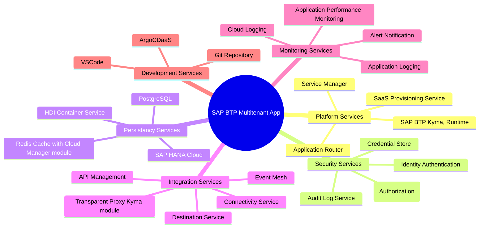

### High-Level Architecture Chart

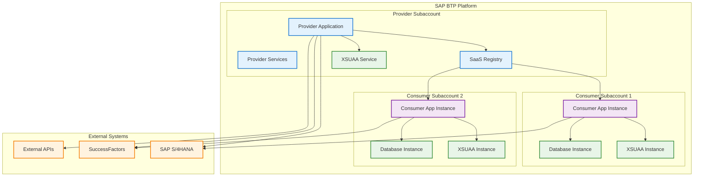

### Subscription Flow Chart

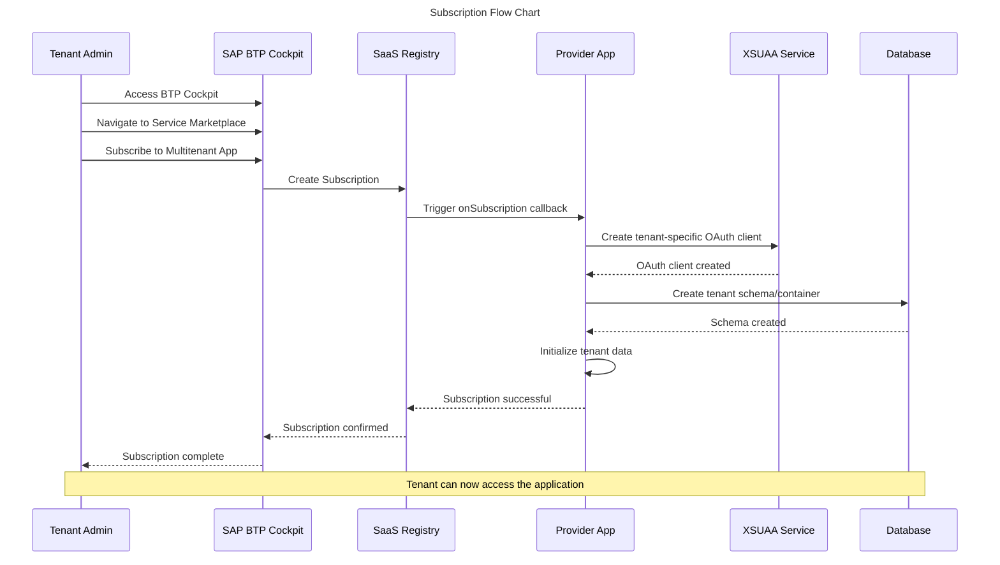


### Tenant Isolation Architecture

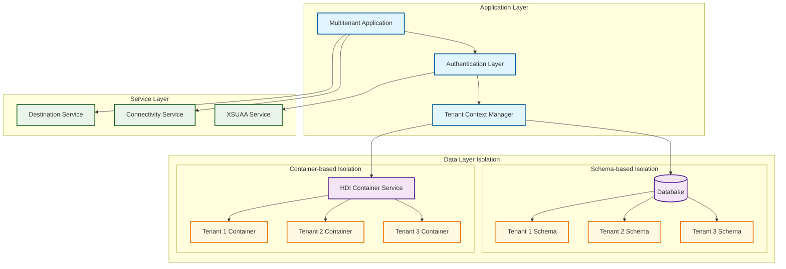


### Request Flow Chart

```mermaid
---
title: Request Flow Chart
---
flowchart LR
    User[End User] --> LB[Load Balancer]
    LB --> APP[Application Router]
    APP --> AUTH{Authentication}
    
    AUTH -->|Not Authenticated| LOGIN[Login Page]
    LOGIN --> IDP[Identity Provider]
    IDP --> XSUAA[XSUAA Service]
    XSUAA --> JWT[JWT Token]
    
    AUTH -->|Authenticated| TENANT[Tenant Resolution]
    JWT --> TENANT
    
    TENANT --> CTX[Set Tenant Context]
    CTX --> BL[Business Logic]
    
    BL --> DATA{Data Access}
    DATA --> SCHEMA[Tenant Schema]
    DATA --> CONTAINER[HDI Container]
    
    SCHEMA --> RESPONSE[Generate Response]
    CONTAINER --> RESPONSE
    RESPONSE --> User
    
    %% Styling
    classDef user fill:#ffcdd2,stroke:#d32f2f
    classDef auth fill:#c8e6c9,stroke:#388e3c
    classDef app fill:#fff3e0,stroke:#f57c00
    classDef data fill:#e1f5fe,stroke:#01579b
    
    class User user
    class LOGIN,IDP,XSUAA,JWT,AUTH auth
    class LB,APP,TENANT,CTX,BL,RESPONSE app
    class DATA,SCHEMA,CONTAINER data
```


### Deployment Architecture

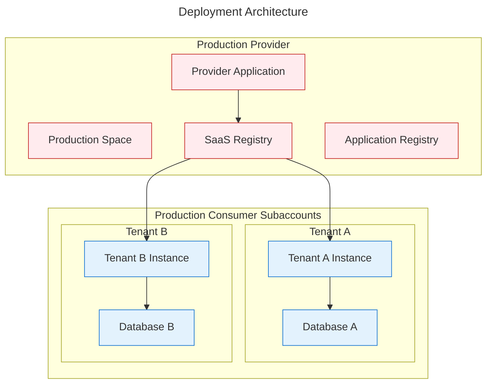

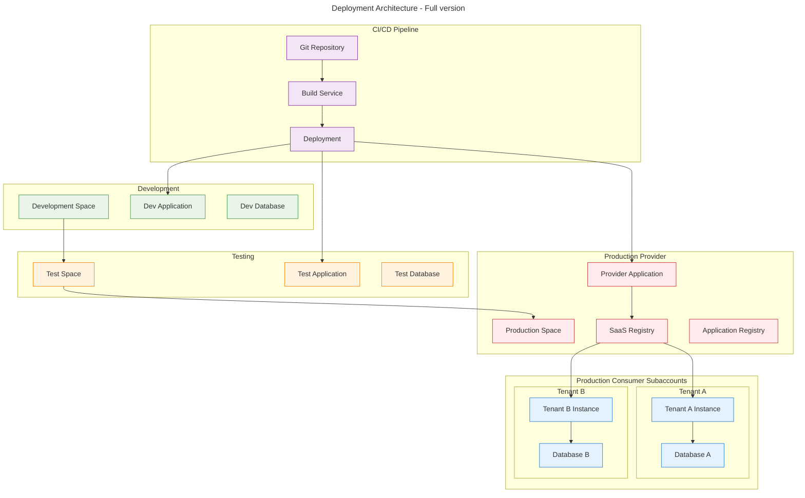

### Tenant Lifecycle Management

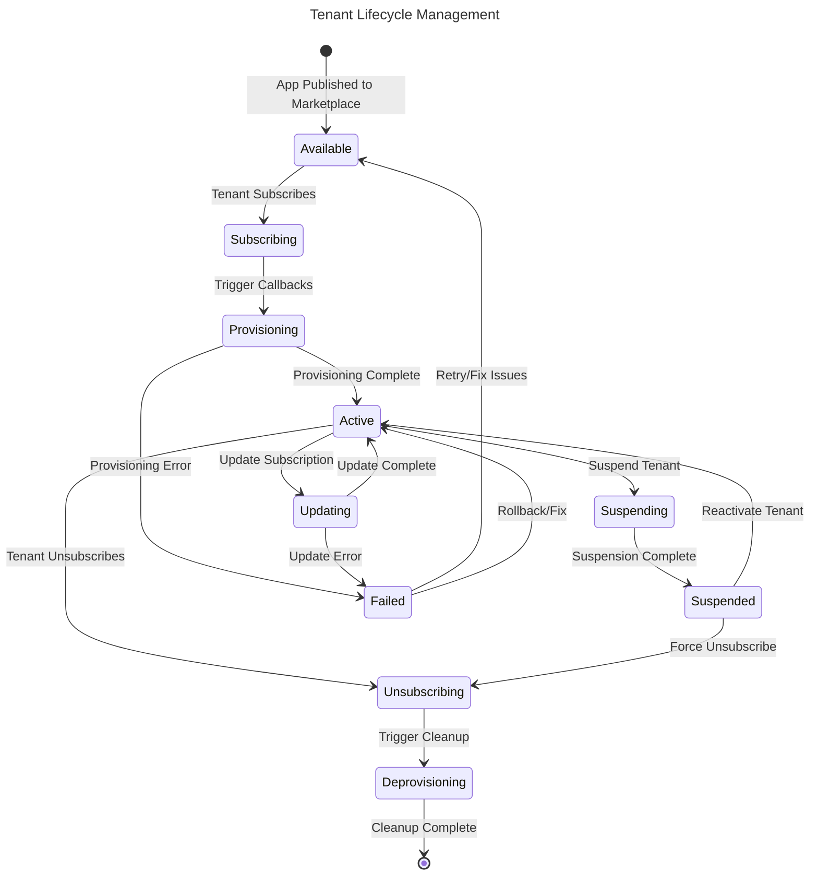


---------

## Day 2 Operations Overview

```
Core Components:

1. Monitoring & Observability
Application performance monitoring (APM)
Infrastructure monitoring
Log aggregation and analysis
Metrics collection and alerting
Distributed tracing

2. Security & Compliance
Security patch management
Vulnerability scanning
Compliance auditing
Access control reviews
Security incident response

3. Performance Optimization
Resource utilization analysis
Performance tuning
Query optimization
Caching strategies
Load balancing adjustments

4. Backup & Disaster Recovery
Regular backup operations
Backup verification
Disaster recovery testing
RTO/RPO compliance
```

### Day 2 Operations Mermaid Chart Code

```mermaid
---
title: Day 2 Operations
---
graph TD
    A[Day 2 Operations] --> B[Monitoring & Observability]
    A --> C[Security & Compliance]
    A --> D[Performance Optimization]
    A --> E[Backup & Disaster Recovery]
    A --> F[Scaling & Capacity Planning]
    A --> G[Maintenance & Updates]
    A --> H[Incident Response]
    A --> I[Cost Optimization]

    B --> B1[Application Monitoring]
    B --> B2[Infrastructure Monitoring]
    B --> B3[Log Management]
    B --> B4[Metrics & Alerting]
    B --> B5[Distributed Tracing]

    C --> C1[Security Patches]
    C --> C2[Vulnerability Scanning]
    C --> C3[Compliance Auditing]
    C --> C4[Access Control]
    C --> C5[Security Incidents]

    D --> D1[Resource Optimization]
    D --> D2[Query Tuning]
    D --> D3[Caching Strategies]
    D --> D4[Load Balancing]
    D --> D5[Performance Testing]

    E --> E1[Regular Backups]
    E --> E2[Backup Verification]
    E --> E3[DR Testing]
    E --> E4[RTO/RPO Planning]
    E --> E5[Data Retention]

    F --> F1[Auto-scaling]
    F --> F2[Capacity Forecasting]
    F --> F3[Resource Provisioning]
    F --> F4[Performance Benchmarks]
    F --> F5[Growth Planning]

    G --> G1[Software Updates]
    G --> G2[Configuration Management]
    G --> G3[Database Maintenance]
    G --> G4[Certificate Renewal]
    G --> G5[Dependency Updates]

    H --> H1[Alert Management]
    H --> H2[Incident Escalation]
    H --> H3[Root Cause Analysis]
    H --> H4[Post-mortem Reviews]
    H --> H5[Process Improvement]

    I --> I1[Resource Optimization]
    I --> I2[Usage Analysis]
    I --> I3[Cost Monitoring]
    I --> I4[Budget Planning]
    I --> I5[Waste Elimination]

    %% Feedback loops
    B4 --> H1
    H5 --> B4
    D1 --> I1
    F2 --> I2
    C2 --> C1
    E3 --> E4

    %% Styling
    classDef mainNode fill:#e1f5fe,stroke:#01579b,stroke-width:3px
    classDef categoryNode fill:#f3e5f5,stroke:#4a148c,stroke-width:2px
    classDef activityNode fill:#e8f5e8,stroke:#1b5e20,stroke-width:1px

    class A mainNode
    class B,C,D,E,F,G,H,I categoryNode
    class B1,B2,B3,B4,B5,C1,C2,C3,C4,C5,D1,D2,D3,D4,D5,E1,E2,E3,E4,E5,F1,F2,F3,F4,F5,G1,G2,G3,G4,G5,H1,H2,H3,H4,H5,I1,I2,I3,I4,I5 activityNode
```

### Day 2 Operations - Alternative flow chart version

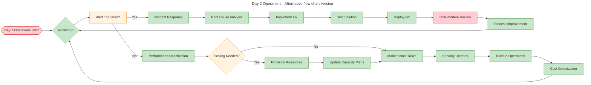

### Day 2 Operations activities

Core Day 2 Operations Areas:

1. Monitoring & Observability: Metrics, logs, traces, and dashboards for system health  
2. Incident Management: Alerting, on-call rotations, incident response, and post-mortems  
3. Capacity Management: Planning, auto-scaling, rightsizing, and quota management  
4. Backup & Recovery: Automated backups, replication, DR testing, and restore procedures  
5. Security Operations: Vulnerability scanning, patch management, audits, and certificate management  
6. Configuration Management: Drift detection, GitOps, secret rotation, and version control  
7. Performance Optimization: Tuning, caching, database optimization, and load testing  
8. Cost Management: Monitoring, optimization, reserved capacity, and chargeback  
9. Change Management: Change requests, deployments, rollbacks, and tracking  
10. Continuous Improvement: SLO reviews, retrospectives, automation, and documentation  

The diagram also shows how different teams (SRE, DevOps, Support, Development, Security) interact with these operations and how supporting systems (ticketing, ChatOps, knowledge bases, CI/CD) enable Day 2 activities.

```mermaid
---
title: Day 2 Operations activities
---
graph TB
    subgraph "Day 2 Operations"
        subgraph "Monitoring & Observability"
            METRICS[Metrics Collection<br/>CPU, Memory, Disk, Network]
            LOGS[Log Aggregation<br/>Application & System Logs]
            TRACES[Distributed Tracing<br/>Request Flows]
            APM[Application Performance<br/>Monitoring]
            DASH[Dashboards<br/>Grafana, Kibana]
        end

        subgraph "Incident Management"
            ALERT[Alerting & Notifications<br/>PagerDuty, Slack, Email]
            ONCALL[On-Call Management<br/>Rotation Schedules]
            INCIDENT[Incident Response<br/>Triage & Resolution]
            POSTMORTEM[Post-Mortem Analysis<br/>Root Cause Analysis]
            RUNBOOK[Runbooks & Playbooks<br/>Response Procedures]
        end

        subgraph "Capacity Management"
            CAPACITY_PLAN[Capacity Planning<br/>Resource Forecasting]
            SCALING[Auto-Scaling<br/>Horizontal & Vertical]
            RIGHTSIZING[Resource Rightsizing<br/>Cost Optimization]
            QUOTA[Quota Management<br/>Limits & Throttling]
        end

        subgraph "Backup & Recovery"
            BACKUP[Automated Backups<br/>Scheduled & On-Demand]
            REPLICATION[Data Replication<br/>Cross-Region/Zone]
            DR_TEST[DR Testing<br/>Failover Drills]
            RESTORE[Recovery Procedures<br/>RTO/RPO Management]
        end

        subgraph "Security Operations"
            VULN_SCAN[Vulnerability Scanning<br/>CVE Management]
            PATCH_MGMT[Patch Management<br/>Security Updates]
            SEC_AUDIT[Security Audits<br/>Compliance Checks]
            ACCESS_REVIEW[Access Reviews<br/>IAM Governance]
            CERT_MGMT[Certificate Management<br/>Rotation & Renewal]
        end

        subgraph "Configuration Management"
            CONFIG_DRIFT[Configuration Drift<br/>Detection & Remediation]
            GITOPS[GitOps Workflows<br/>IaC Version Control]
            SECRET_ROTATE[Secret Rotation<br/>Credential Management]
            VERSION_MGMT[Version Management<br/>Dependencies & Updates]
        end

        subgraph "Performance Optimization"
            PERF_TUNE[Performance Tuning<br/>Query & Code Optimization]
            CACHE_OPT[Cache Optimization<br/>CDN & Memory Cache]
            DB_TUNE[Database Tuning<br/>Index & Query Plans]
            LOAD_TEST[Load Testing<br/>Stress & Capacity Tests]
        end

        subgraph "Cost Management"
            COST_MONITOR[Cost Monitoring<br/>Budget Tracking]
            RESOURCE_OPT[Resource Optimization<br/>Idle Resource Cleanup]
            RESERVED_CAP[Reserved Capacity<br/>Commitment Planning]
            CHARGEBACK[Chargeback/Showback<br/>Cost Allocation]
        end

        subgraph "Change Management"
            CHANGE_REQ[Change Requests<br/>CAB Approval]
            DEPLOY[Deployments<br/>Blue-Green, Canary]
            ROLLBACK[Rollback Procedures<br/>Quick Recovery]
            CHANGE_TRACK[Change Tracking<br/>Audit Trail]
        end

        subgraph "Continuous Improvement"
            SLO_REVIEW[SLO/SLA Review<br/>Target Assessment]
            RETRO[Retrospectives<br/>Team Learning]
            AUTOMATION[Automation Initiatives<br/>Toil Reduction]
            DOC_UPDATE[Documentation Updates<br/>Knowledge Base]
        end
    end

    subgraph "Supporting Systems"
        TICKETING[Ticketing System<br/>Jira, ServiceNow]
        CHAT[ChatOps<br/>Slack, Teams]
        WIKI[Knowledge Base<br/>Confluence, Notion]
        CICD[CI/CD Pipeline<br/>Jenkins, GitLab]
    end

    subgraph "Teams & Stakeholders"
        SRE[SRE Team]
        DEVOPS[DevOps Team]
        SUPPORT[Support Team]
        DEV[Development Team]
        SECURITY[Security Team]
        BUSINESS[Business Owners]
    end

    %% Monitoring flows
    METRICS --> DASH
    LOGS --> DASH
    TRACES --> APM
    DASH --> ALERT

    %% Incident Management flows
    ALERT --> ONCALL
    ONCALL --> INCIDENT
    INCIDENT --> RUNBOOK
    INCIDENT --> POSTMORTEM
    POSTMORTEM --> DOC_UPDATE

    %% Capacity Management
    METRICS --> CAPACITY_PLAN
    CAPACITY_PLAN --> SCALING
    CAPACITY_PLAN --> RIGHTSIZING

    %% Security flows
    VULN_SCAN --> PATCH_MGMT
    SEC_AUDIT --> ACCESS_REVIEW
    CERT_MGMT --> SECRET_ROTATE

    %% Configuration flows
    GITOPS --> CONFIG_DRIFT
    CONFIG_DRIFT --> AUTOMATION
    VERSION_MGMT --> CHANGE_REQ

    %% Performance flows
    APM --> PERF_TUNE
    PERF_TUNE --> LOAD_TEST
    LOAD_TEST --> CAPACITY_PLAN

    %% Cost flows
    METRICS --> COST_MONITOR
    COST_MONITOR --> RESOURCE_OPT
    RESOURCE_OPT --> RIGHTSIZING

    %% Change Management flows
    CHANGE_REQ --> DEPLOY
    DEPLOY --> CHANGE_TRACK
    DEPLOY -.->|If needed| ROLLBACK

    %% Backup flows
    BACKUP --> REPLICATION
    DR_TEST --> RESTORE

    %% Continuous Improvement
    POSTMORTEM --> RETRO
    RETRO --> AUTOMATION
    SLO_REVIEW --> CAPACITY_PLAN

    %% System integrations
    INCIDENT --> TICKETING
    ALERT --> CHAT
    RUNBOOK --> WIKI
    DEPLOY --> CICD
    DOC_UPDATE --> WIKI

    %% Team interactions
    SRE --> MONITORING & Observability
    SRE --> INCIDENT
    SRE --> AUTOMATION
    DEVOPS --> CICD
    DEVOPS --> CONFIG_DRIFT
    SUPPORT --> TICKETING
    DEV --> DEPLOY
    SECURITY --> VULN_SCAN
    BUSINESS --> SLO_REVIEW
    BUSINESS --> COST_MONITOR

    %% Styling
    style ALERT fill:#e74c3c
    style INCIDENT fill:#e67e22
    style BACKUP fill:#27ae60
    style VULN_SCAN fill:#c0392b
    style COST_MONITOR fill:#f39c12
    style AUTOMATION fill:#3498db
    style SLO_REVIEW fill:#9b59b6
    style DEPLOY fill:#16a085
```
